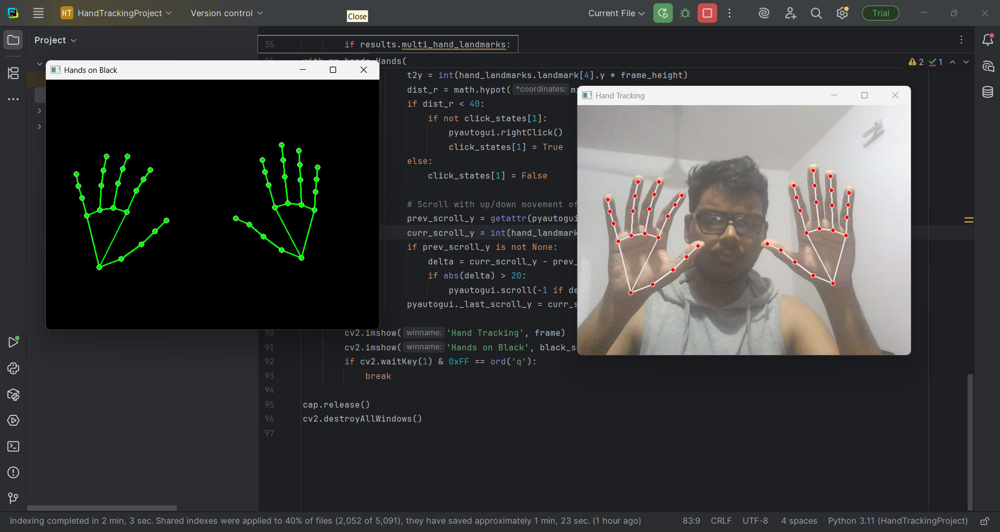

# Dual Hand Virtual Mouse & Visualization🖱️
  
This project uses OpenCV, MediaPipe, and PyAutoGUI to turn dual-hand gestures into full mouse control—cursor movement, clicking, scrolling—and offers a vivid on-screen hand skeleton display for fun interaction.

## Features
- Track both hands live, with all landmarks and outlines shown.
- Move your mouse cursor by pointing your finger.
- Left-click, right-click, and scroll using intuitive pinch gestures.
- Sleek, real-time visualization window with only your hand skeletons.

## 📸 Demo

## Requirements:

- Python 3.10 or 3.11
- Webcam
- Required libraries (install via requirements.txt):
  - opencv-python
  - mediapipe
  - numpy
  - pyautogui

##  Installation: 
git clone https://github.com/yourusername/dual_hand_mouse_project.git
cd dual_hand_mouse_project
python -m venv venv
source venv/bin/activate # On Windows: .\venv\Scripts\activate
pip install -r requirements.txt

##  Usage
- **Hand Tracking** window: webcam with overlays.
- **Hands on Black** window: only the dual hand skeletons.
- Press `q` to quit.

## How It Works

- Uses MediaPipe’s AI to get hand landmarks.
- Maps finger tip positions to your screen for mouse movement.
- Recognizes pinch gestures for left/right click and scrolling.

